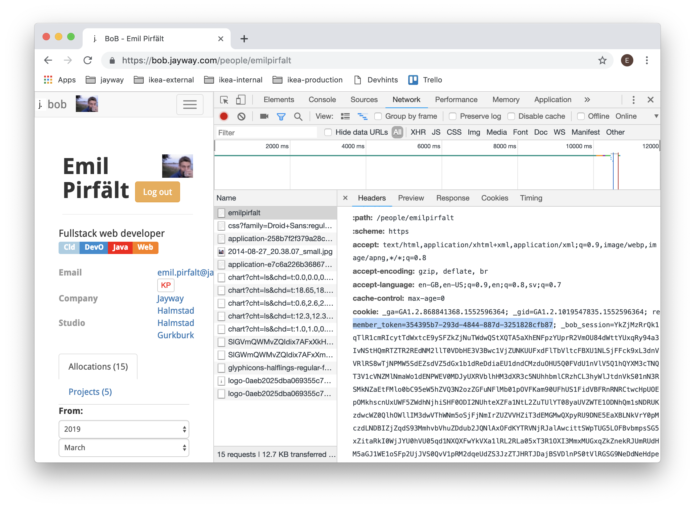
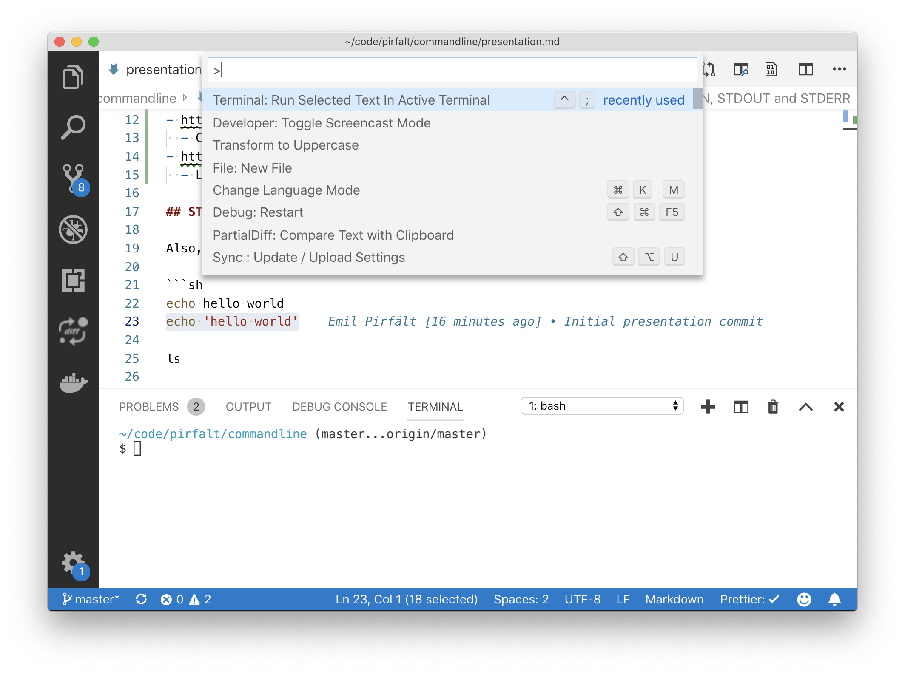

# Commandline basics and a few useful tools

Introduction

- CI/CD
  - On a remote machine or buildserver you may be required to use the commandline.
- Windows 10. Windows subsystem for linux :)
  - Speaker note, this is where I started to learn. Thanks microsoft.

Useful links:

- https://devhints.io/
  - Cheetsheet, I look at this all the time.
- https://github.com/anordal/shellharden
  - Lint your bash scripts, so you don't forget the quotes.

## Preparations




## STDIN, STDOUT and STDERR

Also, some program arguments.

```sh
echo hello world
echo 'hello world'

ls

git status

# Program arguments and flags
curl -v 'example.com'
curl -v 'example.com' > /dev/null
curl -v 'example.com' 2> /dev/null
```

## Redirection

```sh
echo 'data/'

echo 'data/' > .gitignore
echo 'people/' >> .gitignore

git status
```

## Piping

Pipe and filters.

## `cat`

Concatenate multiple input files. Or just the one.

```sh
cat presentation.md
```

## `less`

Read a _less_ of a file. Is also used by many other programs for reading output.

```sh
# Try using `h` for help, `k/j`, `up/down`, `u/d` for movement and `/` for searching.

less presentation.md

git log

man echo
```

## `man`

Read the manual. Using less.

## `curl`

Http calls. Sort of like postman...

```sh
# HTTP GET - example.com
curl -v 'example.com'

# Get bob info
curl --cookie 'remember_token=354395b7-293d-4844-887d-3251828cfb87' \
  'https://bob.jayway.com/people/emilpirfalt'


remember_token='354395b7-293d-4844-887d-3251828cfb87'

curl --cookie "remember_token=$remember_token" \
  --header 'Accept: application/json' \
  'https://bob.jayway.com/people/emilpirfalt'

# Lets save that one
curl --cookie "remember_token=$remember_token" \
  --header 'Accept: application/json' \
  'https://bob.jayway.com/people/emilpirfalt' > emilpirfalt.json
```

## `jq`

JSON queries and transformations.

```sh
jq '' emilpirfalt.json

cat emilpirfalt.json | jq

cat emilpirfalt.json | jq '.image_url'
cat emilpirfalt.json | jq -r '.image_url'

image_url=$(cat emilpirfalt.json | jq -r '.image_url')

echo $image_url
```

Interlude - varibable expansion.

```sh
cookie="remember_token=$remember_token"
header='Accept: application/json'

curl -b $cookie -H $header 'https://bob.jayway.com/people/emilpirfalt'
curl -b "$cookie" -H "$header" 'https://bob.jayway.com/people/emilpirfalt'
```

Continue

```sh
curl -b "$cookie" -H "$header" "$image_url"

curl -h
curl -h | less     # output

curl -b "$cookie" -H "$header" -O "$image_url"
ls

curl -b "$cookie" -H "$header" 'https://bob.jayway.com/people/'
```

## `grep`

Filter, lines.

```sh
curl -b "$cookie" 'https://bob.jayway.com/people/'
curl -b "$cookie" 'https://bob.jayway.com/people/' > people.html

code people.html

curl -b "$cookie" 'https://bob.jayway.com/people/' | grep '<a href="/people/'
curl -b "$cookie" 'https://bob.jayway.com/people/' 2> /dev/null | grep '<a href="/people/'
curl --silent -b "$cookie" 'https://bob.jayway.com/people/' | grep '<a href="/people/'
```

## `sed`

Streaming editor. `sed 's/REGEX/REPLACEMENT/'`

```sh
curl --silent -b "$cookie" 'https://bob.jayway.com/people/' | grep '<a href="/people/' > peoplelinks.txt

cat peoplelinks.txt
cat peoplelinks.txt | sed 's/href="/ REPLACED /'
cat peoplelinks.txt | sed 's/<a href="//'
cat peoplelinks.txt | sed 's/(.*)?<a href="//'                # -E
cat peoplelinks.txt | sed -E -e 's/ *<a href="//' -e 's/">/   /' -e 's/<\/a>//'
cat peoplelinks.txt | sed -E -e 's/ *<a href="//' -e 's/">/   /' -e 's/<\/a>//' > peopletable.txt
```

## `awk`

Filter and/or transform, lines and "columns".

```sh
cat peopletable.txt | awk '{print $1}'
man awk                                                 # sub - split editor
cat peopletable.txt | awk '{ sub($1, "REPLACED", $0); print $0}'
cat peopletable.txt | awk '{ sub($1 "   ", "", $0); print $0}'
cat peopletable.txt | awk '{ sub($1 "   ", "", $0); print $0, $1}'
cat peopletable.txt | awk '{
  url = $1;
  sub($1 "   ", "", $0);
  printf "%d  %40s  %s\n", NR, $0, url
}'
```

## All together now, and loops

```sh
url="https://bob.jayway.com/people/"
for path in $(cat peopletable.txt | awk '{print $1}'); do
  echo "$url$path"
done


# Prepared
url="https://bob.jayway.com"
remember_token='354395b7-293d-4844-887d-3251828cfb87'
cookie="remember_token=$remember_token"
header='Accept: application/json'

curl -b "$cookie" -H "$header" 'https://bob.jayway.com/people/emilpirfalt'

for path in $(cat peopletable.txt | awk '{print $1}'); do
  echo "${url}${path}"
done

for path in $(cat peopletable.txt | awk '{print $1}' | head -2); do
  echo "$url$path"
  # curl -s -b "$cookie" -H "$header" "$url$path" | jq
done

for path in $(cat peopletable.txt | awk '$1 !~ /\./ {print $1}' | head -2); do
  echo "$url$path"
  curl -s -b "$cookie" -H "$header" "$url$path" | jq
done

# Desition point, poll images or slurp data

for path in $(cat peopletable.txt | awk '$1 !~ /\./ {print $1}' | head -2); do
  echo "$url$path" >&2
  curl -s -b "$cookie" -H "$header" "$url$path"
done > personlist.json

cat personlist.json
jq '.id, .created_at, .updated_at, .image_url' personlist.json
jq -r '.image_url' personlist.json


# Soon to be potentially lots of images, lets make a directory for them

mkdir people
cd people
for img_url in $(jq -r '.image_url' personlist.json); do
  echo "$img_url" >&2
  curl -s -b "$cookie" -H "$header" -O "$img_url"
done

ls

rm *

rm -r *
for person in $(jq -r '.username' ../personlist.json); do
  echo "$person" >&2
  mkdir "$person" > /dev/null

  cd "$person" > /dev/null
    img_url=$(jq -r "select(.username == \"$person\") | .image_url" ../../personlist.json)
    curl -s -b "$cookie" -H "$header" -O "$img_url"
  cd ..
done
```

```sh
for path in $(cat peopletable.txt | awk '$1 !~ /\./ {print $1}'); do
  echo "$url$path" >&2
  curl -s -b "$cookie" -H "$header" "$url$path"
done > personlist.json


mkdir people
cd people
for person in $(jq -r '.username' ../personlist.json); do
  echo "$person" >&2
  mkdir "$person" > /dev/null

  cd "$person" > /dev/null
    img_url=$(jq -r "select(.username == \"$person\") | .image_url" ../../personlist.json)
    curl -s -b "$cookie" -H "$header" -O "$img_url"
  cd ..
done

```

## `gnuplot`

Look at data.

```sh

cat personlist.json | jq -r '[.created_at, .updated_at] | join("    ")' | sed -E 's/\.000......//g' \
 | gnuplot -p -e '
set format x "%Y-%m-%d";
set xtics rotate by 90 offset 0,-1;

set format y "%Y-%m-%d";

set timefmt "%Y-%m-%dT%H:%M:%S";
set xdata time;
set ydata time;
plot "-" using 1:2 time;
'
```
